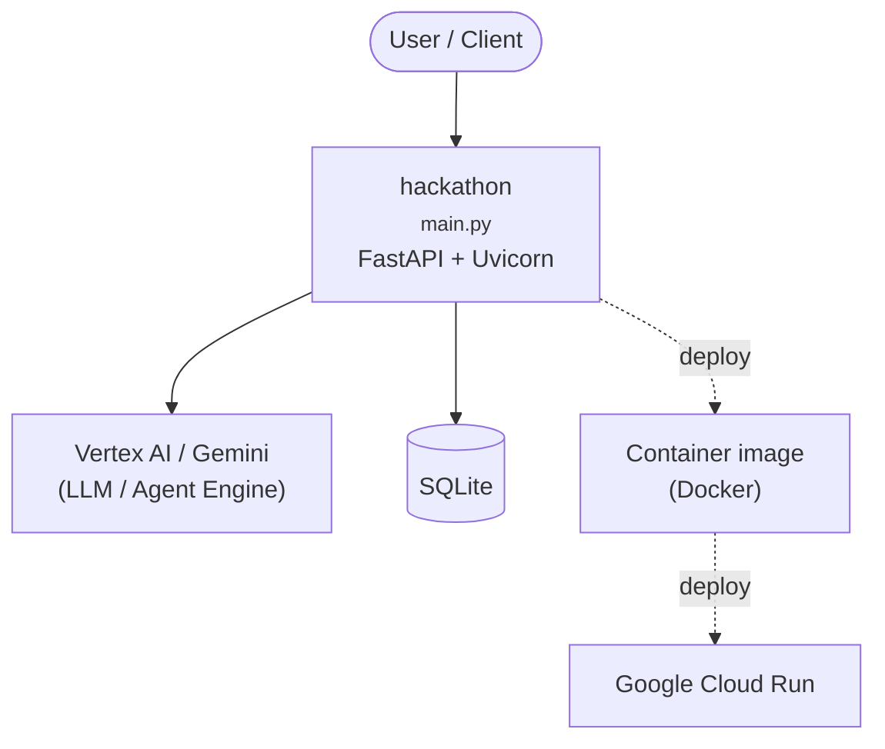

# Context Map — `hackathon`

> Auto-generated architecture & deployment context map. Summarizes the core application, container/cloud footprint, and database connections. Regenerate after significant structural changes.

**Repo:** `avnit/hackathon` · **Original** · Public · Primary language: Python · Default branch: `main` · Files: 121

## 1. Core application

- **Frameworks / runtime:** FastAPI + Uvicorn
- **Entry points:** `ai-agent/main.py`, `ai-agent/search_agent/agent.py`, `ai-agent/search_agent/sub_agents/wiz_agent/agent.py`, `wiz-mcp/src/wiz_mcp_server/server.py`
- **Listens on port(s):** 8080, 22, 587, 8001

## 2. Containers & cloud applications

**Containers:**
- `.dockerignore`
- `ai-agent/.dockerignore`
- `ai-agent/Dockerfile`
- `wiz-mcp/Dockerfile`

**Cloud deploy / serverless manifests:**
- `wiz-mcp/cloudbuild.yaml`

**Detected cloud platforms / services:** Vertex AI / Gemini (GCP), Google Cloud Run, GKE / Kubernetes, Terraform

## 3. Database connections

**Datastores in use:** SQLite

**Referenced in:**
- `ai-agent/main.py`

**Environment / config files:** `ai-agent/__pycache__/.env`, `ai-agent/search_agent/.env`, `wiz-mcp/.env`

> ⚠️ Non-template env files are committed: `ai-agent/__pycache__/.env`, `ai-agent/search_agent/.env`, `wiz-mcp/.env`. Verify no live secrets are tracked.

## 4. Architecture diagram

## 5. Security posture

- **Dependabot alerts (open):** 5 high, 3 medium
- **Static scan findings:** 2 low

| Severity | Rule | File:Line |
|---|---|---|
| low | py-bind-all-interfaces | `ai-agent/Dockerfile:16` |
| low | py-bind-all-interfaces | `ai-agent/main.py:32` |

---
_Generated by repo context-mapping pass on 2026-08-13._